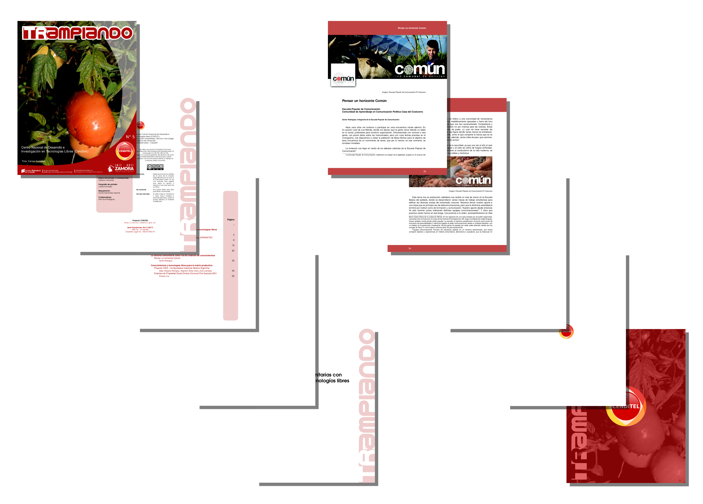

# Plantilla-TRAMPIANDO
----
Plantilla LaTeX para la Revista Trampiando

Esta versión permite el uso de archivos de bibliografía `.bib`

Esta plantilla está basada en la plantilla utilizada para la [Revista CLIC](https://github.com/davidhdz/Plantilla-CLIC) 

----
## Estructura de la plantilla base (trampiando.tex)

```latex
\documentclass[11pt, twoside, letterpaper, openright, final]{book}
\usepackage{trampiando}
\usepackage{emptypage}

\nrorevista{X}
\anocalendario{YYYY}
\isbn{N-AABBCCDD}
\deplegal{ME201XABCDEF}
\autoreditorial{Nombres Apellidos}

\begin{document}

\hojaportada
\hojalicencia
\blankpage
\renewcommand\contentsname{Contenido}
\addtocontents{toc}{\cftpagenumbersoff{chapter}}
\addtocontents{toc}{~\hfill\textbf{Página\\}\par}
\renewcommand{\cftdot}{}
\tablacontenido

\frontmatter
\addtolength{\parskip}{\baselineskip}
\hojaeditorial

\mainmatter
\pagestyle{fancy}
\fancychapterstyle


\chapter{Bloque1}\BgThispage
\blankpage\blankpage
\include{art1}

\chapter{Bloque2}\BgThispage
\blankpage\blankpage
\include{art2}

\pagestyle{plain}
\hojacontraportada
\end{document}

```

----
## Nota
Para que se tomen las bibliografías de forma separada al final de cada artículo se debe compilar un archivo de bibliografía por cada artículo. Ejemplo: `bibtex art1.tex`

----
## Ejemplos

#### Revista TRAMPIANDO N°5.



